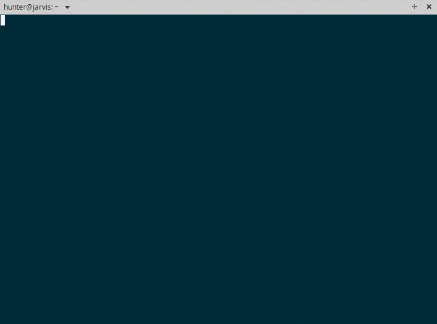

Keep - A Meta CLI toolkit
=========================
    Your personal shell command keeper

====
Why?
====

Raj loves using the command line.

Raj googles "How to do X in terminal?" and multiple forums and blog posts finally provide him the magical *command* for the rescue. Problem Solved !

Fast forward couple weeks, Raj has to do X in terminal, again. Raj remembers solving this few weeks ago. Let him do a reverse-i-search with *Ctrl+R*. Nope, can't remember sh*t. Browser search history? 25 web pages found matching *X*. Argh!

Raj finally finds the solution. From this time Raj starts writing the commands somewhere online for the future.

Wait, why shouldn't he keep the command in his terminal itself if this is only place where he'll ever have use it?

========
Features
========

- Save a new command with a brief description
- Search the saved commands using powerful patterns
- Save the commands on the remote on the server
- Use ``keep push`` and ``keep pull`` to syn the commands between all your computers.

**ProTip : Save the commands you usually forget in ssh sessions and sync it with your local machine.**

Installation
~~~~~~~~~~~~

::

    $ pip install keep

You can install pip using apt-get as ``sudo apt install python-pip``.

=====
Usage
=====

::

    Usage: keep [OPTIONS] COMMAND [ARGS]...

      Keep and view shell commands in terminal only.

      Read more at https://orkohunter.net/keep

    Options:
      -v, --verbose  Enables verbose mode.
      --help         Show this message and exit.

    Commands:
      grep      Searches for a saved command.
      init      Initializes the CLI.
      list      Show the saved commands.
      new       Saves a new command.
      pull      Updates the local database with remote.
      push      Pushes the local database to remote.
      register  Register user over server.
      rm        Deletes a saved command.
      run       Executes a saved command.

`See the detailed usage and tutorial. <https://github.com/OrkoHunter/keep/blob/master/tutorial.md>`_

==========
Contribute
==========

This is a very young project. If you have got any suggestions for new features or improvements, please comment over `here <https://github.com/OrkoHunter/keep/issues/11>`_. Pull Requests are most welcome !

❤

----

Not a command line fanatic? Here are some resources for you :

- https://github.com/jlevy/the-art-of-command-line
- https://github.com/herrbischoff/awesome-osx-command-line
- https://github.com/alebcay/awesome-shell
- https://github.com/aharris88/awesome-cli-apps
